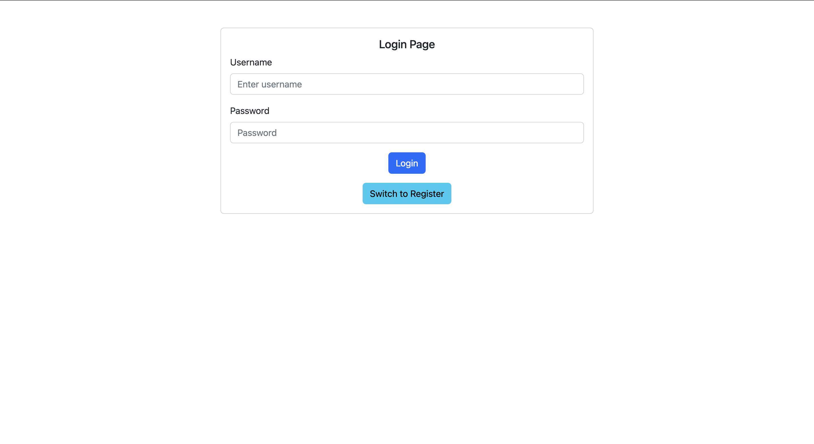
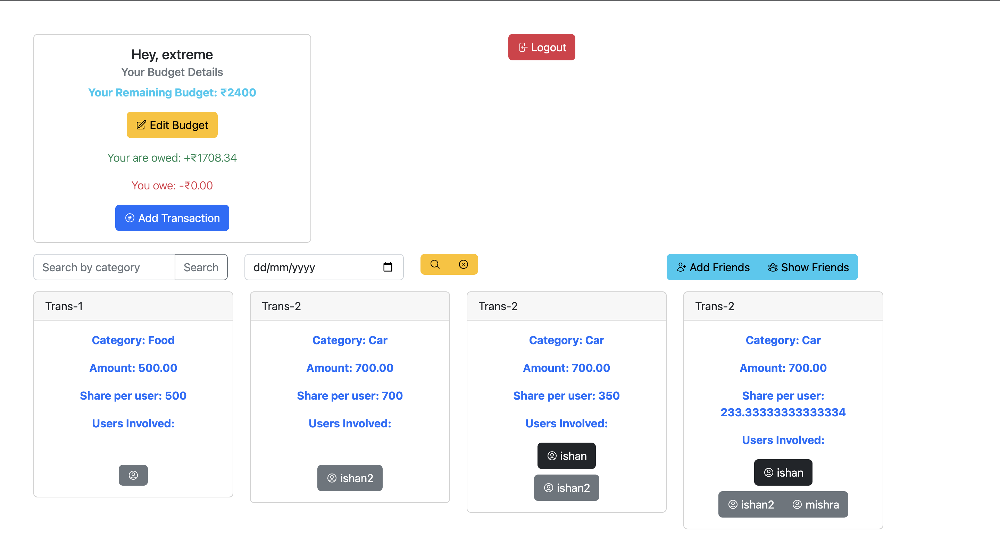
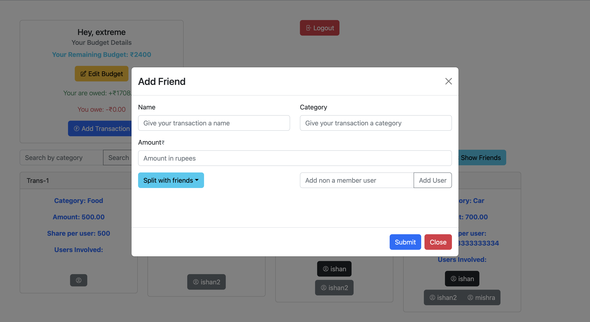
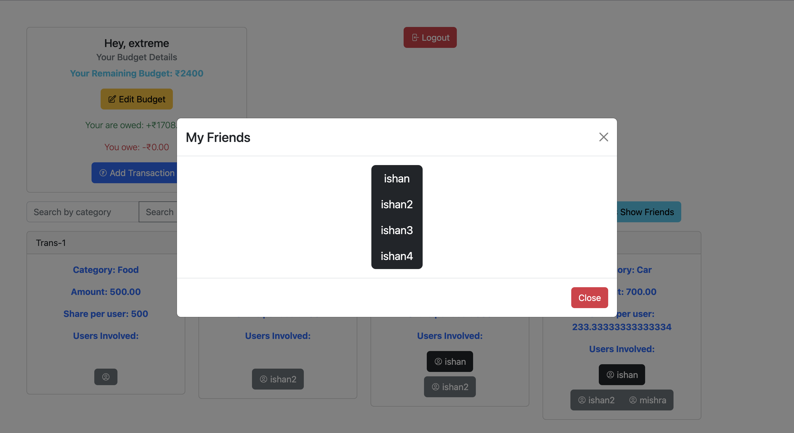
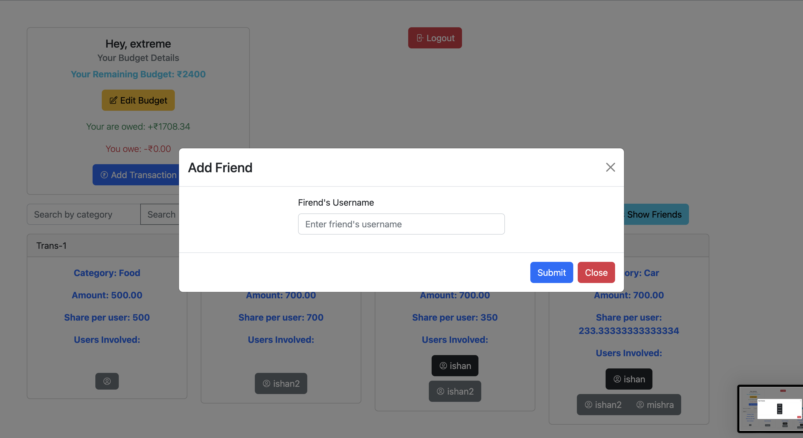
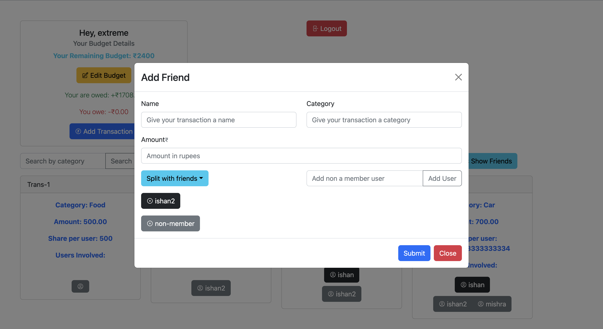

[Github Repo](https://github.com/ishanExtreme/Transaction-Manager.git)

[Frontend](https://github.com/ishanExtreme/Transaction-Manager/tree/frontend)

[backend](https://github.com/ishanExtreme/Transaction-Manager/tree/backend)

## Running Locally

### Backend Setup

clone backend repo using:
`git clone --branch backend https://github.com/ishanExtreme/Transaction-Manager.git`

- Step0: `cd Transaction-Manager`
- Step1: Create a new python environment
- Step2: run `pip install -r requirements/local.txt`
- Step3: run `python manage.py migrate`
- Step4: run `python manage.py runserver`

Good to go!!

### Frontend Setup

clone frontend repo using
`git clone --branch frontend https://github.com/ishanExtreme/Transaction-Manager.git frontend`

- Step0: `cd frontend`
- Step1: npm i
- Step 2: npm start

**Note if facing login issue, delete localstorage token from browser**

**Note: run backend on 8000, if backend is running on some different port, change url from src/api/api.tsx**

Good To go!!

## Screenshots

